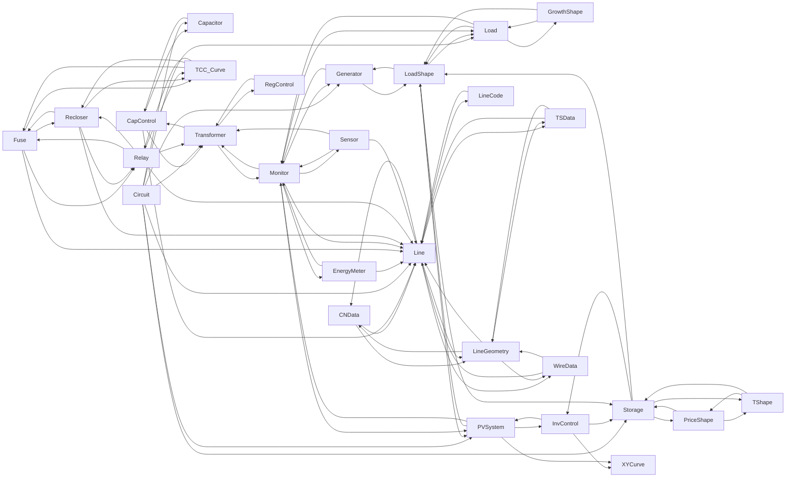

# Object Dependency Graph

<!-- AUTO-GENERATED:START -->

<!-- AUTO-GENERATED:END -->

<!-- CURATED:START -->
- Directed edges represent likely reference/dependency relationships in templates.
<!-- CURATED:END -->
